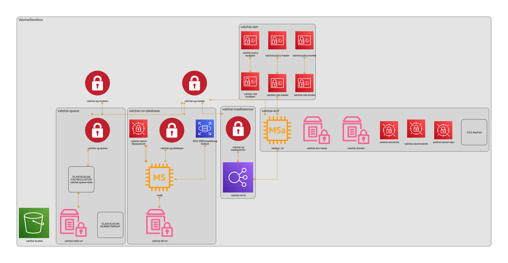

# Valohai Self-Hosted CDK Template

This template allows you provision AWS resources for a self-hosted Valohai installation.

* Security Groups
    * `valohai-sg-workers`: Security Group defining the inbound and outbound rules of Valohai workers that executed all user launched machine learning jobs.
    * `valohai-sg-master`: Security Group that's attached to the Valohai web application instance.
    * `valohai-sg-database`: Attached to the Postgres database instance that stores application data and job information (but not content).
    * `valohai-sg-queue`: Attached to the Redis instance that's used as as a job queue and a short term storage for machine learning job logs. 
* `EC2 instance`: Hosts the core Valohai web application, deployment image building and scaling services. The end-users will access the web application hosted here.
* `RDS PostgreSQL database`: A relational database that contains user data and saves execution details such as which worker type was used, what commands were run, what Docker image was used, which inputs where used and what was the launch configuration.
* `ElastiCache Redis`: Stores information about the job queue and short-term execution logs so they can be shown on the web app and API in real-time. Each job is connected to a queue. The workers fetch a job from the Redis job queue based on their queue name (e.g. machines that belong to queue `t3.medium` will fetch only jobs that marked for that queue)
* `LoadBalancer`: 
* IAM Roles
    * `valohai-master-role`: A role that's attached to the EC2 instance running the core Valohai web app. This role has permissions to
        * create and edit existing auto scaling groups 
        * launch and terminate EC2 instances for the machine learning jobs
        * upload and download files from the default S3 storage
        * access Valohai related secrets from the Secrets Manager
    * `valohai-worker-role`: A role attached to all the EC2 instance that run user schedule machine learning jobs. By default this role only access permissions to set instance protection on itself and describe itself.
    * `valohai-multipart-role`: Used by the web app to allow users to upload large files (over 5GB) to S3 using the user interface.
* `S3 Bucket`: Valohai stores Git commit snapshots in S3 to maintain reproducibility. Worker instances download the user code archives from this storage.
Real-time logs are moved to a persistent storage after the target execution finishes.
* AWS Secrets Manager Secret to store RDS password and Valohai configuration secrets
* AWS SSM Parameter Store to store configuration details

To deploy:
1. Follow the steps below to activate the virtual environment and install requirements.
2. Review the `cdk.json` file for configuration options (VPC, subnet, tags, etc.)

(Diagram automatically generated with [cdk-dia](https://github.com/pistazie/cdk-dia))


## Options

Use the `config.yaml` to define AWS Account details:

* `aws_region` - Which AWS Region to deploy to
* `aws_account_id` - Which AWS Account to deploy to
* `lb_subnet_ids` - A list of subnets for the loadbalancer (public IPs)
* `roi_subnet_id` - A subnet for the main Valohai instance (private IP)
* `db_subnet_ids` - A list of subnets for the Postgres database (private IPs)
* `cache_subnet_ids` - A list of subnets for the Redis cache, which works as the job queue (private IPs)
* `worker_subnet_ids` - A list of subnets for the EC2 instacens that'll be used for Valohai workers (private IPs)
* `vpc_id`- The VPC ID to be used
* `environment_name` - Name of the environment (e.g. MyOrg-Valohai)
* `domain` - Domain to be used for the environment

## Prerequisites

* Configure an AWS profile with your credentials by running `aws configure --profile myname` on your workstation.
* Install Node.js 10.13 or later on your workstation ([nodejs.org](https://nodejs.org/en)). Note that Node.js versions from 13.0.0 to 13.6.0 have compatibility issues with AWS CDK's dependencies. 
* Install the AWS CDK Toolkit:

```
$ npm install -g aws-cdk
```

## Run

To manually create a virtualenv on MacOS and Linux:

```
$ python3 -m venv .venv
```

After the init process completes and the virtualenv is created, you can use the following
step to activate your virtualenv.

```
$ source .venv/bin/activate
```

If you are a Windows platform, you would activate the virtualenv like this:

```
% .venv\Scripts\activate.bat
```

Once the virtualenv is activated, you can install the required dependencies.

```
$ pip install -r requirements.txt
```

At this point you can now synthesize the CloudFormation template for this code.

```
$ cdk synth
```

To add additional dependencies, for example other CDK libraries, just add
them to your `setup.py` file and rerun the `pip install -r requirements.txt`
command.

## Removing Valohai resources

The Postgresql database for Valohai data has delete protection on and it won't be deleted by default. The created S3 Bucket won't be deleted either unless you explicitly set it to be destroyed. Make sure to collect any important files before deleting the bucket. 

To delete the Postgresql database:

* Update the database properties by setting `deletion_protection` to `False` in `backend/postgres/infrastructure.py`.
* Run `cdk synth` and `cdk deploy` on the CLI.

To delete the S3 Bucket:

* Update the bucket properties by setting `removal_policy` to `RemovalPolicy.DESTROY` in `backend/s3/infrastructure.py`.
* Run `cdk synth` and `cdk deploy` on the CLI.

Finally, to remove the delete the whole stack:

* Run `cdk destroy`

## Useful commands

 * `cdk ls`          list all stacks in the app
 * `cdk synth`       emits the synthesized CloudFormation template
 * `cdk deploy`      deploy this stack to your default AWS account/region
 * `cdk diff`        compare deployed stack with current state
 * `cdk destroy`     destroy this stack from your default AWS account/region
 * `cdk docs`        open CDK documentation

Enjoy!
